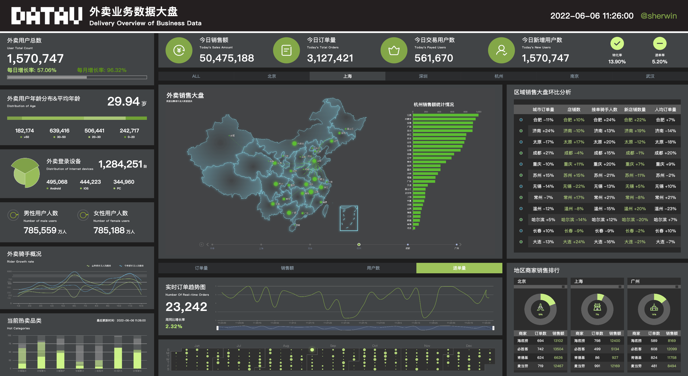

# 数据可视化 - 大屏项目

> 项目主要参考自[实战「慕课外卖」数据大屏](http://www.youbaobao.xyz/datav-docs/)，更多内容请移步 👉 [数据可视化之入门指南](https://www.yuque.com/sherwin-sw/fe/data-visualization)。

## 1.1 技术栈

- Vue3 + TS

- AntV-G2Plot(主)

- ECharts(次) + vue-echarts

## 1.2 关键组件

### 1.2.1 大屏容器组件

[screen-container 组件](./src/components/screen-container.vue)，能够根据当前屏幕尺寸和用户期望尺寸进行比例缩放以达到适配（铺满屏幕）的目的。

### 1.2.2 数字滚动组件

基于 [vue3-count-to](https://www.npmjs.com/package/vue3-count-to) 依赖的组件，通过设定 startVal 和 endVal 实现数字滚动的动态效果。 

### 1.2.3 自动轮播组件

[auto-scroll 组件](./src/components/auto-scroll.vue)，在设定表头和内容后能够自动向上滚动轮播内容（也可借助 Swiper 库来实现）。

---

如果发现本项目有错误，欢迎提交 issues 指正，也可联系邮箱 [sherwin_sw@163.com](mailto:sherwin_sw@163.com)。
